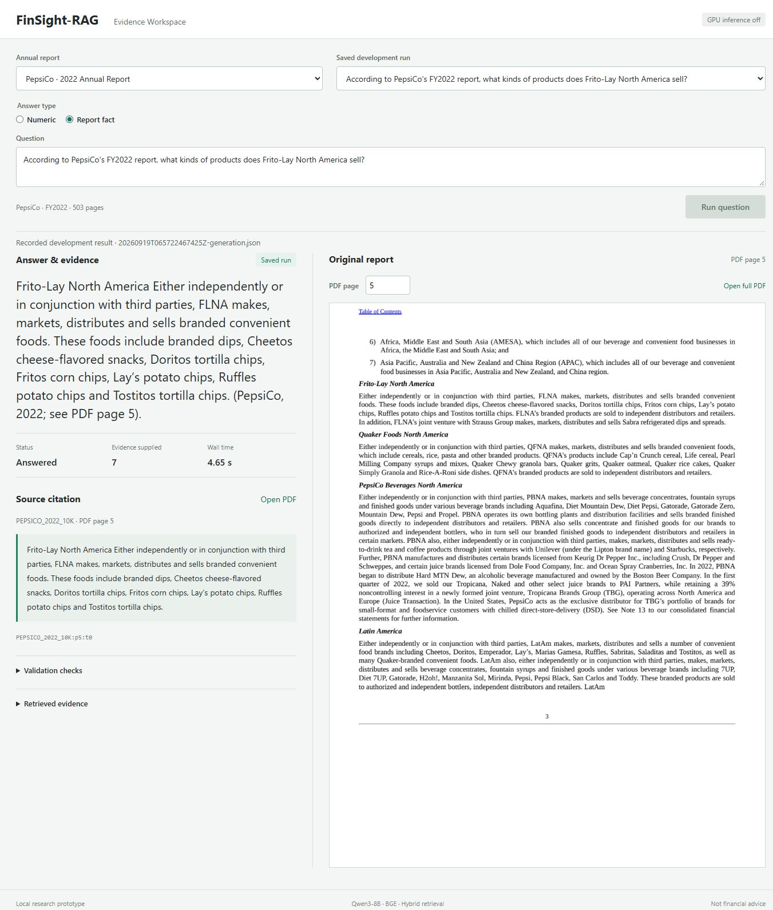

# FinSight-RAG

A local financial-report QA prototype focused on numeric extraction, with hybrid retrieval, source-page
citations, refusal checks and reproducible experiments. Qwen3-8B, CPU BGE
embeddings, BM25 and reciprocal-rank fusion; no paid inference API or hosted service.

**Status:** local portfolio prototype verified: six demonstrations, a new live
question, document-separated evaluation and an isolated reproduction run.
Four-document/two-retriever scope; not a production financial assistant.



Real **saved development output**, not live generation. See the
[12-second saved-result walkthrough](docs/images/accepted-workspace.gif),
[separately verified live question](docs/images/live-cash-question.png), and
[UI verification record](docs/UI_VALIDATION.md). No API key is needed to view these materials.

## Evidence, Not Just an Answer

- Complete-report indexing: **4 PDFs, 997 pages, 2,245 chunks**, including exhibits.
- Statement headers and source spans; answer, quote, PDF page and checks in one view.
- Dense versus BM25 + dense retrieval under the same evidence budget.
- Scope/validation refusals distinguished from model-service failures.
- Historical mistakes and per-case reports retained, not only successful examples.
- Loopback-only viewer without GPU; live inference is an explicit opt-in.
- Quote-only business/risk mode with [six source-reviewed demonstrations](docs/FACT_DEMO.md).

## Measured Results

| Frozen final check | Dense | Hybrid |
| --- | ---: | ---: |
| Numeric target matches | 5/12 | 9/12 |
| Target match with direct citation support | 5/12 | 8/12 |
| Gold-page Recall@10 | 5/12 | 7/12 |
| Gold-page Recall@5 | 5/12 | 3/12 |
| Correct refusals | 3/3 | 3/3 |
| False refusals on answerable questions | 5/12 | 1/12 |

**Numeric matches are not fully grounded accuracy.** Two final hybrid citations
are indirect or definition-sensitive, and one is unsupported. The refusal probes
include two rule-based scope checks and only one model-based refusal per method.
The evaluation is small and not independently annotated; hybrid is not better on
every metric. See the [case-by-case source review](docs/SOURCE_REVIEW.md).

The portfolio set contains 24 numeric questions and six refusal probes. It is
mostly authored, **not an official FinanceBench benchmark**. Reports are separated:
3M/PepsiCo for development, AMD/CVS Health for final evaluation. See
[evaluation and raw reports](docs/PORTFOLIO_EVALUATION.md) and
[corpus provenance](docs/CORPUS.md).

Final inference used a local RTX 4070 SUPER 12 GB: sampled whole-device peak
9,486 MiB, paid API cost USD 0. Hybrid warm question completion p50/p95 was
4.16/6.66 s (n=13, excluding index setup). A first browser question including setup
and model loading took 120.85 s. Electricity was not measured. Full timing and
denominator definitions are in the evaluation report.

## Run Locally

Windows/PowerShell, from the repository root after
[installing dependencies and preparing the corpus](docs/LOCAL_SETUP.md):

```powershell
# Real saved results and original report pages. No GPU.
.\.venv\Scripts\python.exe -m scripts.app --port 8765

# Tests and CPU-only development retrieval.
.\.venv\Scripts\python.exe -m pytest -q
.\.venv\Scripts\python.exe -m ruff check scripts tests
.\.venv\Scripts\python.exe -m scripts.portfolio_eval --split development --stage retrieval
```

Open `http://127.0.0.1:8765`. Saved development outputs are explicitly labeled.
For new questions, free the GPU, start dedicated local Ollama and restart the app
with `--allow-gpu`, following the Windows guide. No automatic cloud fallback.
A verified saved example reports 3M's 2018 capex as USD 1,577 million with a
cash-flow-table citation at PDF page 46. The new live cash-balance question cites
the formal cash-flow statement at PDF page 60.

## How It Works

```text
Full PDF -> page text + statement-aware chunks -> CPU BGE / BM25 indexes
Question -> dense or hybrid retrieval -> bounded evidence -> local Qwen3-8B
Answer -> scope, units and citation checks -> answer or refusal + original page
```

[Architecture and learning guide](docs/ARCHITECTURE.md) explains the modules.
Evaluation labels are separate from runtime inputs. Quote presence and numeric
checks establish limited properties, not semantic proof.
中文学习路线见[面试与理解提纲](docs/INTERVIEW_GUIDE.md)。

## Limitations

Fixed English corpus, numeric extraction and a narrow extractive fact mode. No OCR,
reranker, general accounting reasoning, cross-document synthesis or user uploads.
Qualitative evidence is limited to two exposed fact demonstrations, not a held-out
qualitative benchmark. Small single-author evaluation; no generalization claim. Wrong
columns, units and distracting statements remain failure modes. Not financial
advice. The server is for local single-user use, not internet deployment.

The [failure analysis](docs/FAILURE_ANALYSIS.md) includes wrong metric selection,
per-share confusion, invalid quote joins, false refusals and ambiguous evaluation
definitions. A real quote can still support the wrong answer.

## Experiment Trail

- [Supplied-evidence check](docs/LOCAL_VALIDATION.md): 18/18 repeated checks after
  formatting changes; no retrieval involved, not 18 independent questions.
- [Initial retrieval](docs/RETRIEVAL_CHECK.md), [query processing](docs/QUERY_EXPERIMENT.md),
  [table headers](docs/TABLE_EXPERIMENT.md), [combined comparison](docs/COMBINED_EXPERIMENT.md).
- [Initial end-to-end failures](docs/RAG_SMOKE.md), [answer guards](docs/ANSWER_GUARDS.md),
  [new evaluation and evidence selection](docs/PORTFOLIO_EVALUATION.md).

中文：[原始需求](docs/SPEC_V1.md)、[缩减范围与验收](docs/DELIVERY_CHECKLIST.md)、
[简历描述与指标边界](docs/RESUME.md)。[复现记录](docs/REPRODUCTION.md)说明新环境验证和缓存复用的区别。
