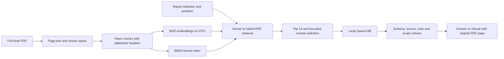

# Architecture and Learning Guide

FinSight-RAG is a local, single-report question-answering prototype focused on
numeric extraction, with an experimental extractive business/risk fact mode. It
separates finding evidence, generating an answer and checking that answer.

## Responsibilities

| Area | Modules | Why it exists |
| --- | --- | --- |
| Inputs | `corpus.py`, `prepare_corpus.py` | Fixed report IDs and checksums prevent silent source changes. |
| Extraction | `retrieval.py`, `table_chunks.py` | Retain page identity, text spans and nearby table headers. |
| Search | `query_processing.py`, `retrieval.py` | Financial query normalization, CPU embeddings, BM25 and reciprocal-rank fusion. |
| Generation | `rag.py`, `local_smoke.py` | Bounded evidence, structured output and fixed local inference endpoint. |
| Validation | `answer_guards.py`, `rag.py` | Check scope, units, source spans and quote presence; reject invalid output. |
| Evaluation | `portfolio_eval.py`, `demo_check.py` | Separate labels from runtime inputs, freeze settings and retain per-case failures. |
| Demo | `app.py`, `page_preview.py`, `web/` | Local HTTP workflow, real saved results, CPU page images and optional live questions. |

The application never loads evaluation questions to answer a new question. It
indexes the selected report, retrieves candidates from that entire index and
supplies only a bounded subset to the model. Evaluation reads labels afterwards.
Saved development examples are explicitly labeled, not presented as live inference.

## Design Choices

- BM25 helps exact financial terms; embeddings help wording variation. RRF combines
  ranked lists without pretending their raw scores are directly comparable.
- Statement chunks repeat column headers but record header and body as separate
  source spans. Validation forbids treating their artificial join as one quote.
- Retrieving the right page is insufficient: the relevant row must survive chunking
  and context selection, and the model must select the correct year and unit.
- Quote matching proves text provenance, not semantic entailment. Numeric checks
  are narrow heuristics, not a general accountant or hallucination detector.
- Output that fails the implemented checks becomes a validation refusal. Some
  semantically wrong outputs still pass; checks do not detect every unsupported
  answer. A network/model failure stays a service error, not a successful refusal.
- Report-fact mode requires a short verbatim body excerpt from a retrieved chunk.
  The delivered answer uses that quote, not the model's unverified paraphrase. It
  accepts only the selected report year and leaves value/unit empty. These checks
  still do not prove question relevance; actual answers need manual review.
- The web server binds to loopback and validates Host/Origin. It is not an
  authenticated, multi-user production service and must not be exposed online.
- Page previews use CPU PDFium rendering with serialized access, bounded resolution
  and a small in-memory cache; see the [renderer API](https://pypdfium2.readthedocs.io/en/stable/python_api.html).

## Resource Lifecycle

Default demo mode only reads saved results and renders original pages. It does not
start or contact Ollama. CPU extraction/indexing runs on demand; an enabled live
session retains indexes in RAM and permits one question at a time. Model weights
are unloaded after each interactive question, increasing the next cold-start cost.
Batch evaluations reuse the model and unload at the end. Nothing is scheduled in
the background; no game detection or automatic training termination is installed.

Before a new GPU work session, coordinate with any other training workload. The
`--allow-gpu` flag is an explicit session opt-in, not a GPU reservation mechanism.

## Read in This Order

Start with `data/corpus.json` to see the supported documents. Follow one question
through `answer_question` in `rag.py`, then inspect the retrieval result and its
source spans. Compare a passing case and a failed case in a saved report. Finally
read the evaluator to see why development results are not held-out accuracy.

Deferred: OCR, reranking, multi-document reasoning, arithmetic reasoning, uploads,
authentication and hosted deployment. Extractive qualitative QA has two accepted
development fact demonstrations, not a held-out qualitative benchmark; see
[demonstration protocol](FACT_DEMO.md) and [source review](SOURCE_REVIEW.md).
